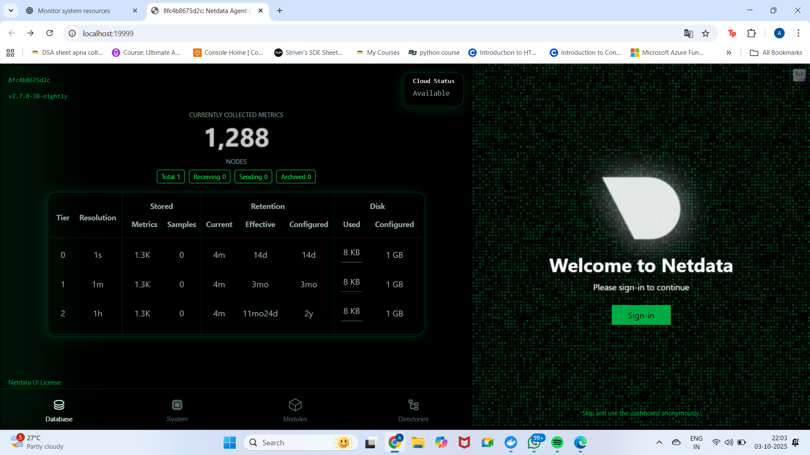
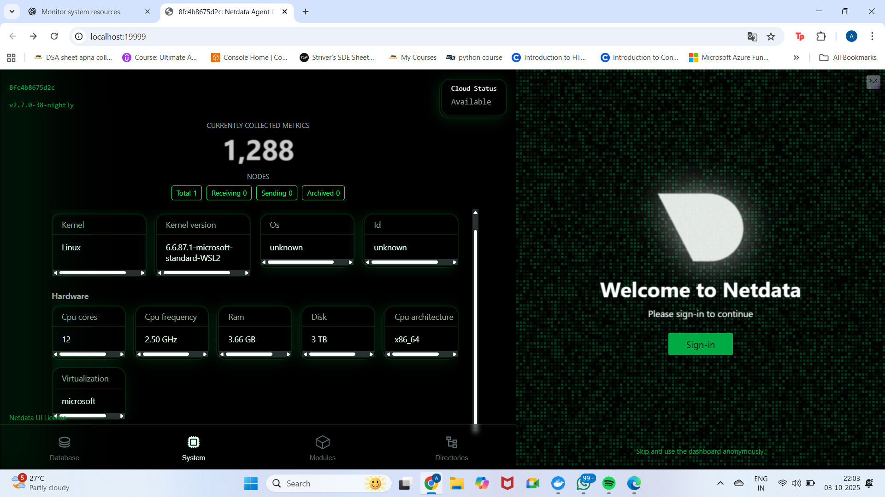
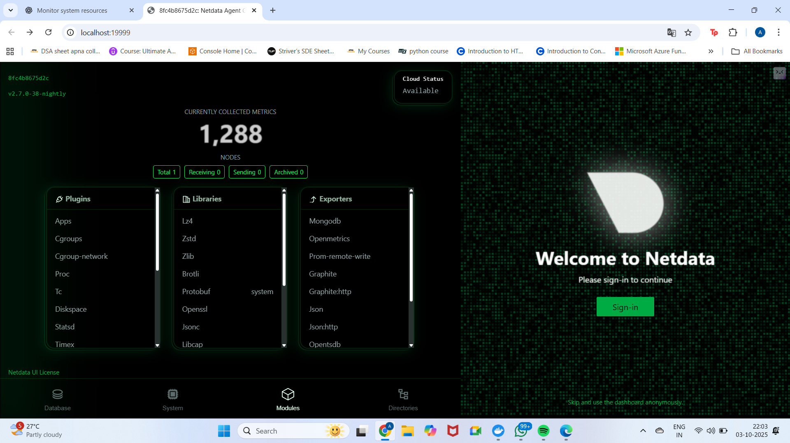
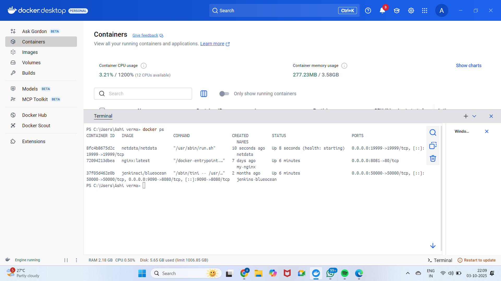

📌 Objective

Install and run Netdata in Docker to monitor system and application performance in real time.

🛠️ Tools Used

Docker Desktop (to run containers)

Netdata (lightweight monitoring tool)

GitHub (for documentation & deliverables)

🚀 Steps Performed

Verify Docker installation

docker version

Run Netdata container

docker run -d --name=netdata -p 19999:19999 netdata/netdata

Check running containers

docker ps

Access Netdata dashboard
Open http://localhost:19999
 in the browser.

Explore Metrics

CPU, RAM, Disk usage

Docker containers monitoring

Alerts and logs in /var/log/netdata

Capture Deliverables

Screenshots of dashboard panels and running container.

📸 Screenshots
🖼️ Netdata Dashboard

🖼️ System Information

🖼️ Modules & Plugins

🖼️ Directories & Configurations

🖼️ Docker Container Running

✅ Deliverables

Screenshots of monitoring dashboards

README.md documenting the task

🎯 Outcome

Netdata was successfully installed and run using Docker.

Real-time monitoring of CPU, memory, disk, and containers was achieved.

Deliverables uploaded to GitHub for verification.

## 📸 Screenshots

### Netdata Dashboard

### System Info

### Modules

### Directories

### Docker ps Output

